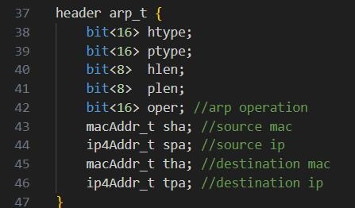
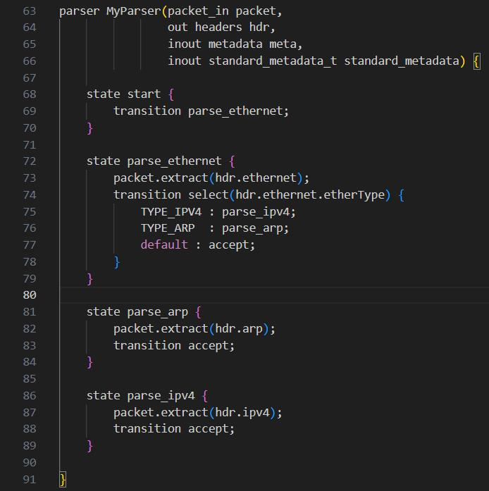
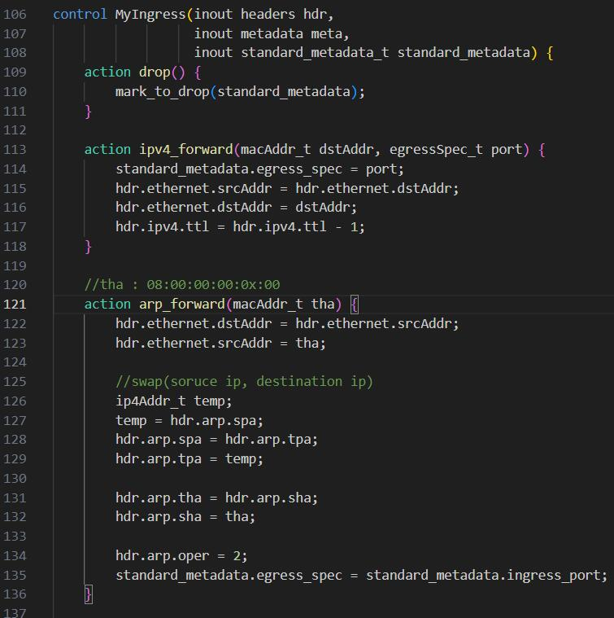
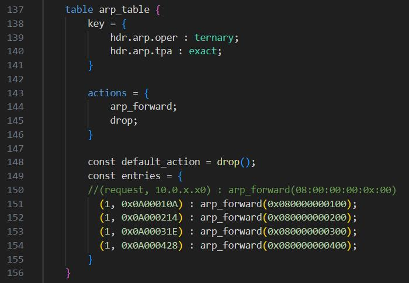
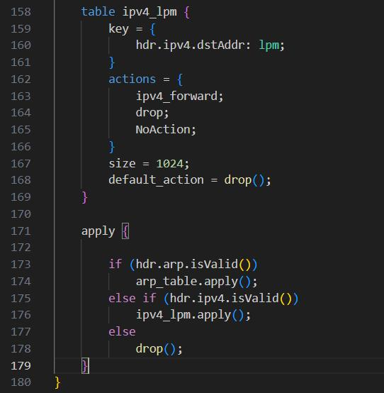

### 1.2.1 进阶1

#### 实验内容
在basic实验中，去掉topology.json文件中已经为每台主机定义的arp转发选项，将arp功能实现到现有basic.p4中。参考：tutorials/P4D2_2017/exercises/arp at sigcomm_17 · p4lang/tutorials · GitHub 当中arp相关的处理方式。

#### 实验结果

一、 确定交换机对于arp的行为
1. arp -i eth0 -s 10.0.x.x0 08:00:00:00:0x:00命令给host添加了10.0.x.x0对应的mac，在后续处理中需要将10.0.x.x0的mac发给host
2. 由wireshark可知：
.png)
.png)
在过程中原先request的源的ip与mac为reply的目的的ip与mac，reply的源的ip为request的目的的ip，而reply的源的mac需要填入其源所对应的mac，即10.0.x.x0对应的08:00:00:00:0x:00

二、 实现arp头部

二、 实现MyParser，处理arp

三、 实现arp_table

实际上就是在原版basic.p4的基础上加入arp_table，通过匹配arp是request和对应的destination ip传入destination mac

四、 测试pingall
.jpg)

五、 测试send.py/recevie.py
.jpg)

六、 wireshark(s1 eth1为例)
.jpg)
.jpg)

